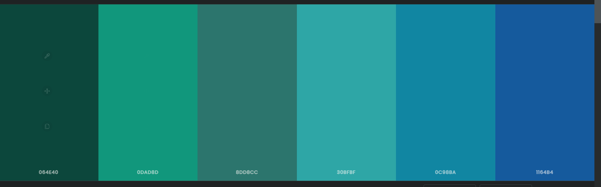

# Expense-Tracker-App
A repository that contains the UI designs for the expense tracker application which is developed as a part of Web Programming (S7 course, NITC)

## Login and Sign Up

## Profile

## Expense Overview

## Add Expense

| Tech Stack | Usage | 
| ----- | -------- | 
|HTML|HyperText Markup Language that is used to define the structure and content of a page|
|CSS|Cascading Style Sheets gives a design to the HTML elements|
|Bootstrap|A CSS framework to support responsive development of pages|
|Javascript|A programming language that gives the interactive element to a page|
|Fusion Charts|A Javascript charting library to give dynamic and interactive charts and graphs|

### Website Palette

